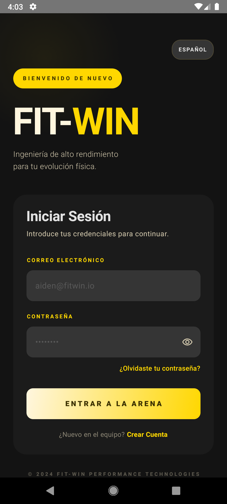
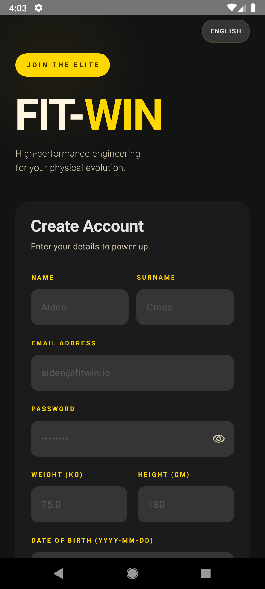
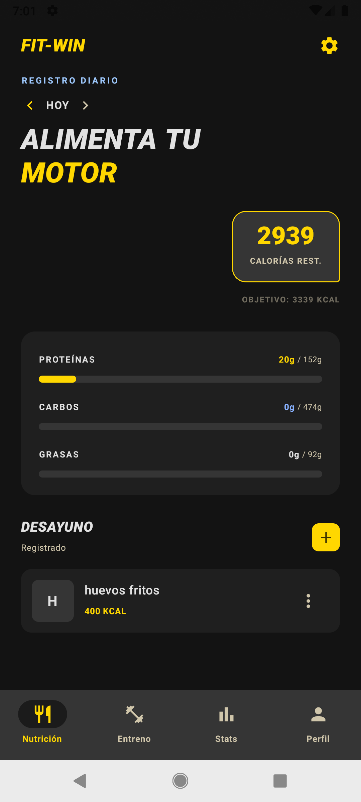
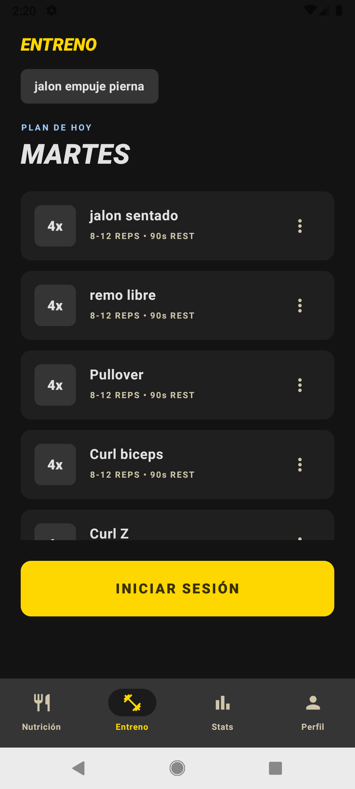
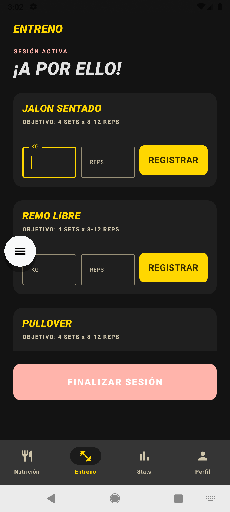
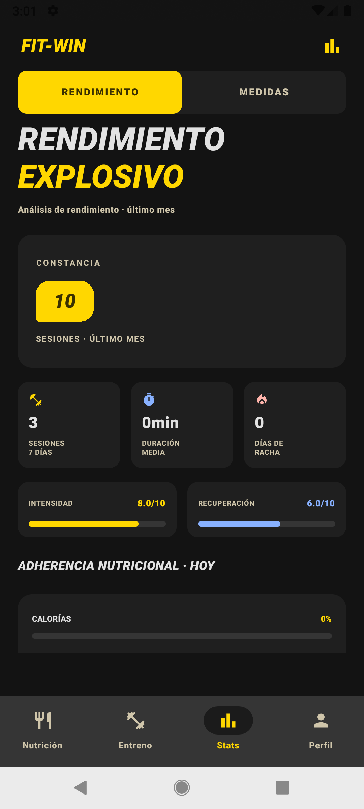
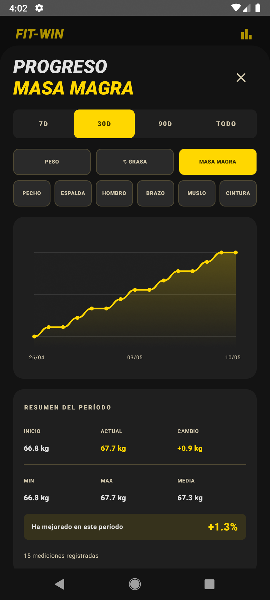
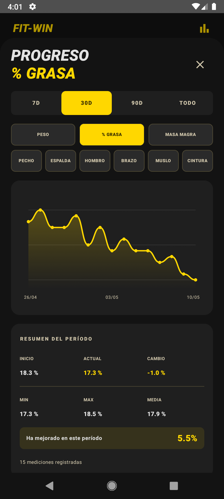
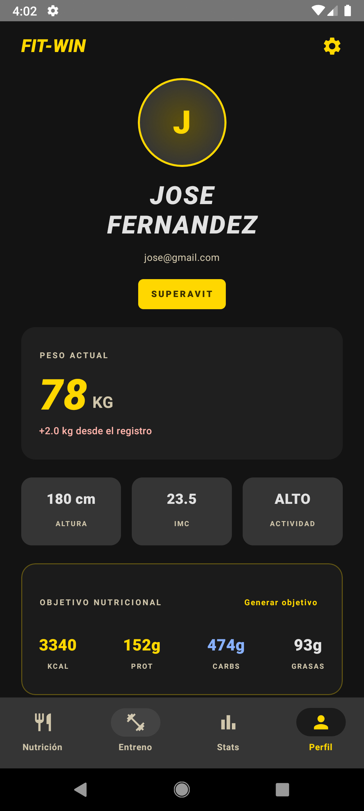
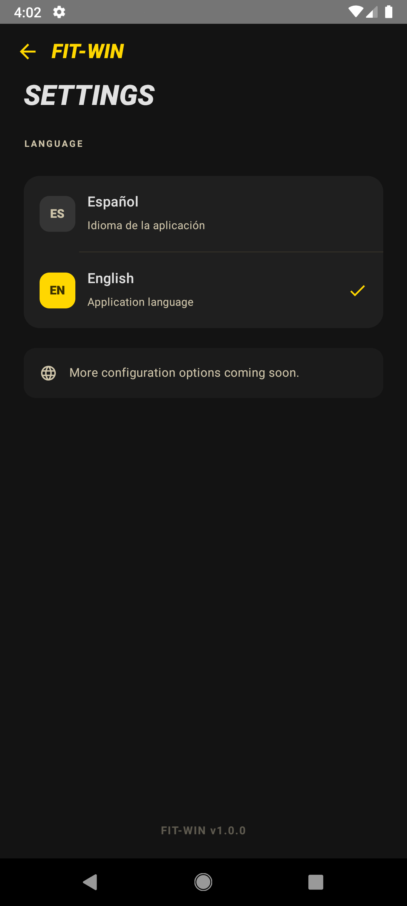

<div align="center">

# 🏋️ FitWin

**De un TFG de escritorio a una app móvil moderna con API segura.**

[](https://kotlinlang.org/)
[](https://developer.android.com/jetpack/compose)
[](https://spring.io/projects/spring-boot)
[](https://mariadb.org/)
[](https://docs.docker.com/compose/)

</div>

---

## La Historia

FitWin empezó como mi Proyecto de Fin de Ciclo. En su primera versión era una app de escritorio hecha con **JavaFX** que se conectaba a una API REST en **Spring Boot**. Funcionaba, pero era una interfaz de escritorio antigua que no tenía nada que ver con lo que se usa hoy en día en el mercado.

Decidí rehacer el cliente desde cero usando **Kotlin Multiplatform (KMP)** y **Jetpack Compose** para demostrar que puedo saltar de stack, aprender por mi cuenta y llevar un proyecto real a un nivel profesional. El backend lo mantuve (porque la API estaba bien diseñada), pero lo refactoricé para mejorar la seguridad y añadir funcionalidades que faltaban.

El resultado es un ecosistema completo: una app móvil moderna con una estética brutalista que consume una API REST segura, todo dockerizado para que cualquiera pueda levantarlo y probarlo.

---

## Qué Hay en el Repo

```
FitWin/
├── FitWinKMP/        → App móvil (Kotlin Multiplatform + Jetpack Compose)
├── ApiUsuarios/      → API REST (Spring Boot 3.2 + JWT + Rate Limiting)
├── fitwin-javafx/    → App de escritorio original (JavaFX 21 — legacy)
└── docker-compose.yml → Levanta API + MariaDB con un solo comando
```

---

## 📱 La App Móvil (KMP)

<div align="center">

**Login & Registro**

 &nbsp; 

---

**Nutrición — Registro diario de macros**



---

**Entrenamiento — Plan del día y sesión activa**

 &nbsp; 

---

**Estadísticas — Rendimiento, medidas y gráficas**

 &nbsp;  &nbsp; 

---

**Perfil y ajustes de idioma**

 &nbsp; 

</div>

### Qué hace

- **Nutrición:** Registro diario de comidas por tipo (desayuno, almuerzo, cena, snack), con barras de progreso de macros que se calculan contra el objetivo calórico real del usuario. Navegación entre fechas, edición y eliminación de comidas.
- **Entrenamiento:** Creador de rutinas con días activos, catálogo de ejercicios, sesiones de entrenamiento en vivo con tracking de series y pesos en tiempo real. Detección automática de records personales.
- **Estadísticas:** Gráficas de progreso interactivas dibujadas desde cero sobre el Canvas de Compose (sin librerías). Historial de mediciones corporales y check-ins.
- **Perfil:** Datos del usuario, peso actual vs inicial, IMC calculado, objetivo nutricional con desglose de macros, generación automática de objetivos y cambio de idioma en tiempo real (ES/EN).
- **Autenticación:** Login, registro, gestión de sesión con refresh token automático y logout.

### Con qué está hecho

| Tecnología | Para qué |
|:---|:---|
| **Kotlin Multiplatform** | Compartir lógica de negocio entre plataformas |
| **Jetpack Compose** | UI declarativa y reactiva (Material 3) |
| **Ktor Client** | Llamadas HTTP con interceptor de auth automático |
| **Coroutines + StateFlow** | Estado reactivo (MVVM con flujo unidireccional) |
| **Multiplatform Settings** | Persistencia local de tokens y sesión |
| **Canvas nativo** | Gráficas custom sin dependencias externas |

### Cómo está organizado el código

El código del cliente sigue **Clean Architecture orientada a Features**. Nada de carpetas genéricas con 50 archivos. Cada módulo del dominio está aislado:

```
features/
├── auth/       → data/ (DTOs, API, Repository) + presentation/ (ViewModel)
├── food/       → data/ (DTOs, API, Repository) + presentation/ (ViewModel)
├── training/   → data/ (DTOs, API, Repository) + presentation/ (ViewModel)
├── stats/      → data/ (DTOs, API, Repository) + presentation/ (ViewModel)
└── profile/    → data/ (DTOs, API, Repository) + presentation/ (ViewModel)
```

La UI está separada en `ui/` con una carpeta por pantalla. Los ViewModels exponen un `StateFlow<UiState>` sellado (sealed class) y los Composables solo leen ese estado y emiten eventos. Cero lógica en la vista.

### Cosas que me parecen interesantes de lo que he implementado

**Refresh Token invisible:** El `ApiClient` usa el plugin `Auth` de Ktor. Si una petición devuelve 401, el interceptor automáticamente pide un nuevo token, lo guarda y reintenta la petición original. La UI ni se entera. El usuario nunca ve un "sesión expirada".

**Gráficas a mano en Canvas:** En vez de meter una librería pesada para las gráficas de progreso, las dibujo directamente sobre el Canvas de Compose con curvas de Bézier, gradientes y detección de toques. Es más trabajo, pero demuestra que entiendo cómo funciona el renderizado por debajo.

**Fallbacks locales:** Si el backend falla, la app no se queda bloqueada. Los ViewModels tienen lógica de fallback: si no pueden cargar ejercicios globales usan una lista mock, si no pueden iniciar sesión de entrenamiento crean una local, etc.

**Internacionalización sin reiniciar:** El cambio de idioma (ES/EN) funciona en tiempo real usando `CompositionLocalProvider`. Sin reiniciar la activity, sin recargar nada.

---

## ⚙️ La API (Spring Boot)

### Qué hace

12 controladores REST que cubren todo el dominio: usuarios, autenticación, rutinas, ejercicios, sesiones de entrenamiento, series, comidas, mediciones corporales, objetivos, records personales, fotos de progreso y catálogo de ejercicios.

### Seguridad

La API tiene una cadena de seguridad de dos capas:

1. **Rate Limiting (Bucket4j):** Cada IP tiene un límite de 50 peticiones por minuto. Si lo excede → `429 Too Many Requests`. Esto protege contra fuerza bruta y DDoS antes de que la petición llegue a tocar la base de datos.

2. **JWT Stateless:** Sin sesiones en memoria. El servidor valida la firma criptográfica del token en cada petición. Sistema dual de Access Token (24h) + Refresh Token (30 días) con rotación automática.

Los secretos (contraseña de BD, clave JWT) se inyectan por variables de entorno. Nunca están hardcodeados en el código.

### Comportamientos automáticos

- Cuando registras una serie con `completado: true` y el peso supera tu record anterior → el backend **crea o actualiza el record personal automáticamente**. No hay que llamar a otro endpoint.
- Cuando finalizas una sesión de entrenamiento → el backend **calcula la duración automáticamente** a partir de las timestamps de inicio y fin.

### Stack

- Spring Boot 3.2 (Java 21)
- Spring Security + jjwt 0.12.5
- Spring Data JPA + Hibernate
- MariaDB
- Bucket4j 8.9.0
- Lombok

---

## 🖥️ La App de Escritorio (Legacy)

La primera versión del proyecto. JavaFX 21 con FXML, TilesFX para los dashboards, ControlsFX para los controles avanzados e Ikonli para iconos vectoriales. Arquitectura MVC clásica.

Se queda en el repo como referencia del punto de partida. La gracia está en comparar el código de JavaFX con el de Compose y ver cuánto ha cambiado la forma de hacer interfaces.

---

## 🚀 Cómo Probarlo (Guía para Ejecución Externa)

Esta sección detalla cómo poner en marcha todo el ecosistema (Base de Datos, API Backend y Aplicación Móvil) desde cero.

### Opción 1: Despliegue Rápido con Docker Compose (Recomendado)

Esta opción levanta automáticamente la base de datos MariaDB, compila y despliega el backend, y ejecuta el script seeder que precarga datos reales de prueba. Solo necesitas tener instalado [Docker Desktop](https://www.docker.com/products/docker-desktop/).

1. **Clonar e iniciar contenedores**:
   ```bash
   docker-compose up -d --build
   ```

2. **¿Qué ocurre por debajo?**
   - **MariaDB** (`fitwin-db`): Arranca con el volumen persistente de base de datos.
   - **API Spring Boot** (`fitwin-api`): Compila el código, descarga dependencias, gestiona las migraciones JPA y expone el puerto `3036` en `http://localhost:3036/api/v1/FWBBD/`.
   - **Seeder** (`fitwin-seeder`): Espera a que la API esté lista (healthcheck activo) e inyecta un set completo de datos iniciales.

3. **Datos de prueba listos para iniciar sesión**:
   Una vez que el contenedor `fitwin-seeder` se apague correctamente (puedes verificarlo con `docker ps -a`), tendrás este usuario disponible:
   > **Usuario:** `prueba@fitwin.com`
   > **Contraseña:** `fitwin123`
   >
   > *Datos precargados:* 20 ejercicios en catálogo global, rutina preestablecida PPL, histórico de 2 sesiones de entrenamiento completas con records personales autodetectados, mediciones físicas iniciales, objetivos calóricos y comidas registradas del día de hoy.

4. **Verificar estado de carga**:
   ```bash
   docker logs fitwin-seeder
   ```

---

### Opción 2: Compilar y Ejecutar la Aplicación Móvil (KMP)

El frontend es un desarrollo de **Kotlin Multiplatform**. Puedes compilar e instalar la aplicación móvil directamente desde el código fuente para probarla en tu propio dispositivo o emulador.

#### Requisitos Previos:
- Java JDK 17 o superior.
- [Android Studio Koala](https://developer.android.com/studio) o superior con Android SDK configurado.

#### Pasos para Compilar la APK desde la terminal:
1. Navega al directorio del cliente móvil:
   ```bash
   cd FitWinKMP
   ```
2. Ejecuta el empaquetado de Gradle para generar la APK de depuración:
   - **En Windows (CMD / PowerShell)**:
     ```powershell
     .\gradlew.bat assembleDebug
     ```
   - **En macOS / Linux**:
     ```bash
     ./gradlew assembleDebug
     ```
3. **Localizar e Instalar la APK**:
   Una vez completada con éxito la compilación, el archivo APK generado se encontrará en la ruta:
   `FitWinKMP/composeApp/build/outputs/apk/debug/composeApp-debug.apk`
   Puedes arrastrar esta APK a un emulador Android abierto o instalarla en un terminal físico mediante `adb install composeApp-debug.apk`.

> 💡 **Nota de Conectividad**:
> - Si ejecutas la app en un **emulador Android**, conectará al host automáticamente mediante la dirección IP puente `10.0.2.2:3036`.
> - Si la ejecutas en un **dispositivo móvil real**, asegúrate de que el terminal móvil y tu ordenador estén en la misma red local (Wi-Fi), y configura la IP local de tu máquina en el archivo de configuración `ApiClient.kt` de la app móvil.

---

### Opción 3: Ejecución Manual y Local (Sin Docker)

Si prefieres ejecutar los servicios de manera nativa sin el aislamiento de Docker, sigue estos pasos:

#### 1. Preparar la Base de Datos
- Levanta una instancia local de **MariaDB** o MySQL.
- Crea un esquema de base de datos vacío llamado `fit_win`:
  ```sql
  CREATE DATABASE fit_win CHARACTER SET utf8mb4 COLLATE utf8mb4_unicode_ci;
  ```

#### 2. Configurar y Arrancar el Backend (API)
Debido a las directivas de seguridad robustas de la API, **es obligatorio** pasar la clave secreta JWT como variable de entorno, ya que no se permiten fallbacks por defecto en producción:

- **En Windows (PowerShell)**:
  ```powershell
  $env:JWT_SECRET="una_clave_secreta_super_larga_y_segura_de_al_menos_32_bytes_12345"
  $env:DB_PASSWORD="tu_password_de_mariadb" # Opcional si no es 'root'
  cd ApiUsuarios
  .\mvnw.cmd spring-boot:run
  ```
- **En macOS / Linux**:
  ```bash
  export JWT_SECRET="una_clave_secreta_super_larga_y_segura_de_al_menos_32_bytes_12345"
  export DB_PASSWORD="tu_password_de_mariadb" # Opcional si no es 'root'
  cd ApiUsuarios
  ./mvnw spring-boot:run
  ```

El servidor web de Spring Boot se iniciará en el puerto `3036`. Las tablas se auto-generarán gracias a Hibernate DDL en la primera ejecución.

#### 3. Ejecutar el Frontend
- Abre la carpeta raíz `FitWinKMP` utilizando **Android Studio**.
- Espera a que finalice la sincronización del proyecto con Gradle.
- Selecciona el dispositivo/emulador objetivo en la barra de herramientas superior y pulsa el botón **Run** (ícono de play).

---

## Lo que he aprendido con este proyecto

- A migrar un proyecto completo de un stack (JavaFX) a otro (KMP + Compose) sin tirar el backend.
- A implementar un sistema de autenticación real con Access/Refresh Tokens y renovación silenciosa.
- A dibujar interfaces custom sobre Canvas cuando las librerías de terceros no encajan con lo que necesitas.
- A diseñar una arquitectura de código que escala: cada feature es un módulo aislado que puedes tocar sin romper el resto.
- A proteger una API con rate limiting y JWT stateless.
- A dockerizar un backend para que cualquiera pueda levantarlo sin configurar nada.
- A gestionar estado reactivo con StateFlow y flujo unidireccional de datos.
- A internacionalizar una app en tiempo real sin reinicios.

---

## Autor

Desarrollado por **Omar** — empezó como proyecto de escritorio y fue refactorizado y ampliado por cuenta propia.
